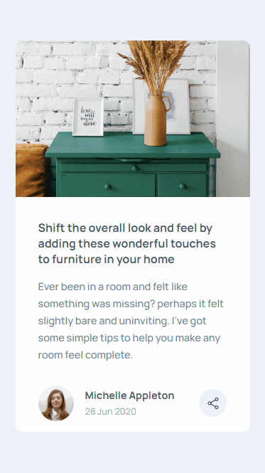
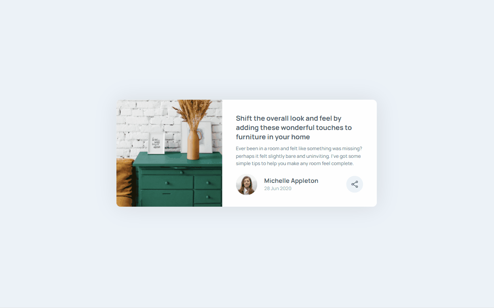

# Sobre o Projeto
Projeto clone do desafio [FrontEnd Mentor](https://www.frontendmentor.io/challenges/article-preview-component-dYBN_pYFT), utilizado o conceito mobile first na responsividade da aplicação

### Desing Mobile

### Design Desktop

# Tecnologias utilizadas
* HTML
* CSS
* JS
